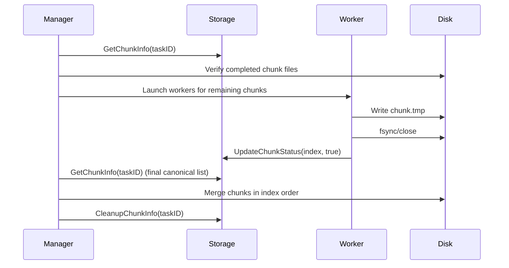

# Download Manager — Developer Guide

> Clean, reliable resumable downloads. This guide explains lifecycle, chunk lifecycle, resume semantics, and best practices for contributors.

---

## Overview

The download manager follows a simple lifecycle: create download manager → create task → calculate & persist chunks → start download (per-chunk saves and updates). The system supports pausing and resuming downloads by task ID.

This document documents the expected behavior, invariants, and the exact flow contributors should follow. A mermaid diagram follows to make the flow easy to understand.

---

## Quick Summary (high level)

1. **Create DownloadManager** — construct and configure limits (MaxGoroutines, storage, output paths).
2. **Create Task** — create task metadata (ID, URL, DIR, TotalSize, ChunkCount, etc.) and persist it.
3. **Calculate Chunks** — split file into `N` chunks (store canonical chunk list, each with index, start, end, filepath, expected size, completed flag). Persist the full chunk list under the task ID.
4. **Start Download** — for each chunk spawn worker(s) and:

   * Save chunk start state (optional)
   * Download chunk to `task.DIR + ".tmp"/chunk{index}`
   * Verify `os.Stat` size matches expected `ChunkTotalSize`
   * Mark chunk `Completed=true` and persist that single chunk update
5. **Resume Download** — given `taskID` verify completed chunks, remove incomplete chunk files from disk (they will be redownloaded), and download remaining chunks. After final chunk verifies, merge chunks and cleanup chunk info.

---

## Mermaid flowchart

```mermaid
flowchart TD
  A[Create DownloadManager] --> B[Create Task]
  B --> C[Calculate & Persist Full Chunk List]
  C --> D[Start Download]
  D --> E[Chunk Worker]
  E --> F{Chunk file exists & correct size?}
  F -- yes --> G[Mark chunk completed, persist chunk status]
  F -- no  --> H[Write chunk to .tmp file; verify size; persist completed status]
  G --> I[All chunks completed?]
  H --> I
  I -- yes --> J[Merge Chunks]
  J --> K[Cleanup tmp, cleanup chunk metadata]
  I -- no  --> D

  %% Resume path
  R[Resume Download(taskID)] --> S[Load full chunk list from storage]
  S --> T[For each chunk: if Completed==true verify on-disk size]
  T --> U{Verified?}
  U -- yes --> V[Keep completed]
  U -- no  --> W[Delete file, mark incomplete]
  V --> X[Collect incomplete chunks into remaining list]
  W --> X
  X --> Y[Launch workers for remaining list]
  Y --> I
```

````

---

## Important invariants & rules (contributor must preserve)

- **Always persist the _full canonical chunk list_ under the task ID** when you initially create chunks. This is the single source of truth for chunk ordering and `ChunkCount`.
- **Do NOT overwrite the canonical chunk list with only the remaining chunks**. Persist partial/temporary state separately if you must, or only save single-chunk updates (`updateChunkStatus(taskID, index, completed)`) rather than replacing the list.
- **Completed flag semantics**:
  - `Completed==true` in storage means the chunk was previously downloaded and *expected* to be correct. On resume you **must** verify the on-disk file size equals `ChunkTotalSize` before trusting it.
  - If the on-disk file is missing or size mismatches, mark the chunk `Completed=false`, delete the file (if present) and add it to the remaining list.
- **I/O atomicity**: When writing a chunk file, write to the `.tmp` chunk file and fsync/close before marking `Completed=true` to avoid races and corruption.
- **Persist single updates** — use an `updateChunkStatus(taskID, index, completed)` call to flag completion; avoid `saveChunkInfo(task, chunkSlice)` that replaces the whole chunk slice in storage unless you intentionally mean to replace it.

---

## Suggested helper functions (pseudo signatures)

```go
// storage layer
SaveTask(task *Task) error
GetTask(taskID string) (*Task, error)
SaveCanonicalChunkList(taskID string, chunks []storage.ChunkInfo) error // called once at chunk creation
GetChunkInfo(taskID string) ([]storage.ChunkInfo, error) // returns canonical list with Completed flags
UpdateChunkStatus(taskID string, index int, completed bool) error // update individual chunk
CleanupChunkInfo(taskID string) error // remove all chunk metadata after merge

// runtime helpers
DownloadChunkToTemp(task *Task, chunk storage.ChunkInfo) error
VerifyChunkOnDisk(chunk storage.ChunkInfo) (bool, error)
MergeChunks(task *Task, canonicalChunks []storage.ChunkInfo) error
````

---

## Example: resume logic (pseudocode)

1. Load task: `task := GetTask(taskID)`
2. Load canonical list: `allChunks := GetChunkInfo(taskID)`
3. For every chunk in `allChunks`:

   * If `chunk.Completed == true` then `ok := VerifyChunkOnDisk(chunk)`

     * if `ok == true` keep as completed
     * else delete chunk file, set `chunk.Completed=false`, and call `UpdateChunkStatus(taskID, chunk.Index, false)`
   * If `chunk.Completed == false`, append to `remaining` list
4. Launch workers for `remaining` list and update every single chunk on success using `UpdateChunkStatus`
5. When all chunks are `Completed==true` call `MergeChunks` with `allChunks` (in original index order)
6. After merge, call `CleanupChunkInfo(taskID)` and mark `task.Status = "completed"`

---

## Common pitfalls & fixes

* **Saving `validChunks` over the canonical list** — this causes the stored chunk list to shrink every restart. *Fix:* never replace the canonical list with the remaining list; use `UpdateChunkStatus` to change a single chunk flag.
* **Incorrect `DownloadedSize` accounting** — update the task-level `DownloadedSize` only when you successfully verify a chunk and persist that change. Protect with a mutex if multiple workers update the task object concurrently.
* **Merging order** — always merge using the canonical chunk order by `Index` to reconstruct the file correctly.
* **Premature cleanup** — only call `CleanupChunkInfo` after the merge succeeds. Otherwise you'll lose the canonical list and may not be able to resume.

---

## Developer checklist before open PR

* [ ] Verified canonical chunk list is created once and persisted.
* [ ] Resume verifies completed chunks on disk before trusting them.
* [ ] No code overwrites canonical list with only remaining chunks.
* [ ] Single-chunk updates use `UpdateChunkStatus` (atomic storage op).
* [ ] Chunk writes use `.tmp` files and atomic rename when complete.
* [ ] Merge reads canonical list and validates the final file size/hash.

---

## Appendix — Merge diagram (sequence)



---

If you want, I can also:

* provide a ready-made Go patch that replaces the problematic `saveChunkInfo(existingTask, chunks)` with safe calls to `UpdateChunkStatus` and preserves the canonical list, and update `getExistingChunks` with the improved loop.
* add a unit-test plan and an integration test harness (fake storage + temp files) to prevent regressions.

---

<small>Generated on contributor request — keep this doc in the repo root as `DOWNLOAD_MANAGER_DEV_GUIDE.md`.</small>
